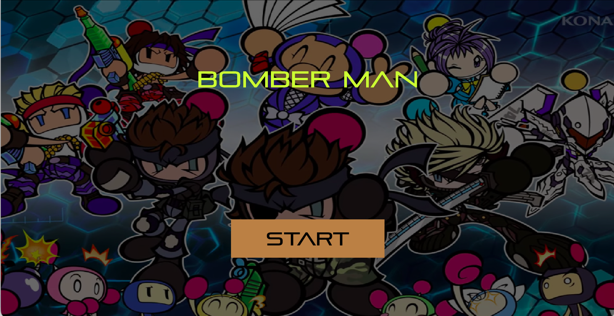
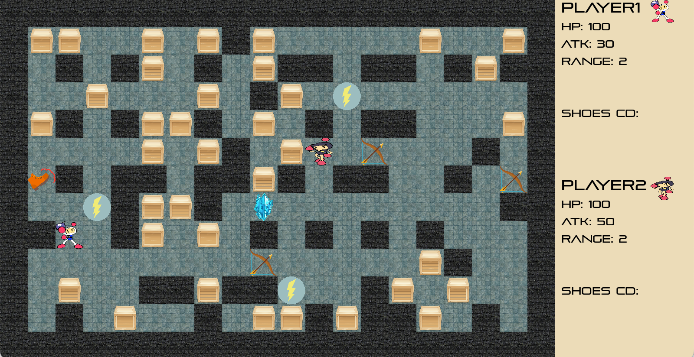
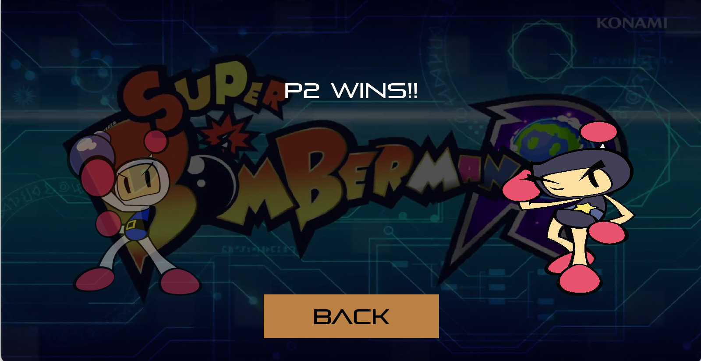

# Bombman
NTHU CS. 10720 CS135602 Introduction to Programming (II). Final Project.
Bombman game developed by Allegro5.

## Installation
Follow the step [here](https://github.com/j3soon/Allegro5Template/blob/master/docs/README.md).

## Game rules
- This game needs 2 players to play.
- Similar to other bombman games, players attack others or get abilities and props by placing bombs. 
- There are 4 kinds of abilities / props
  - Thunder (ability): increase the damage of the bomb.
  - Arrow (ability): increase the explosion range.
  - Shoes (prop): Able to kick the placed bombs in a period of time.
  - Ice (prop): Freeze the player's movement.
- Kill the other player (when HP reaches 0) to win the game!

## Player control 
- Player1
  - Space: place a bomb
  - R: Using ice prop
  - E: Using shoes prop
- Player2
  - L: place a bomb
  - I: Using ice prop
  - K: Using shoes prop

## Game Scene
- Start

- Play

- Finish

