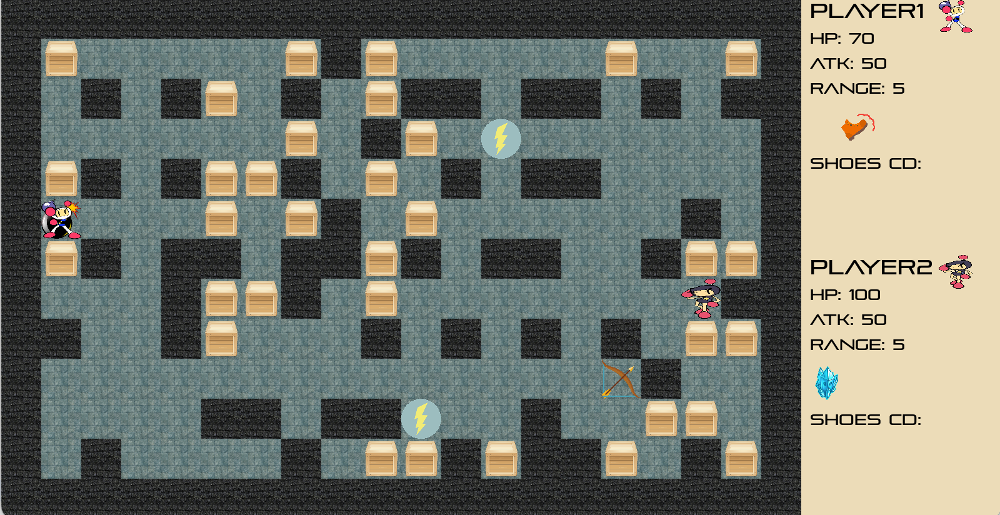

# Bombman
NTHU CS. 10720 CS135602 Introduction to Programming (II). Final Project.
Bombman game developed by Allegro5.

## Installation
Follow the step [here](https://github.com/j3soon/Allegro5Template/blob/master/docs/README.md).

## Game rules
- This game needs to 2 players to participate.
- Similar to other bombman games, players attack others or get some abilities and props by placing bombs. 
- There are 4 kinds of abilities / props
  - Thunder:
  - Arrow: increasing the explosion range.
  - Shoes:
  - Ice:
- Kill the other player (when HP reaches 0) to win the game!

## Player control 
- Player1
  - Space: place a bomb
  - E: 
  - R: 
- Player2
  - L:
  - I:
  - K: Using shoes ability

## Game Scene
- Start

- Play

- Finish

